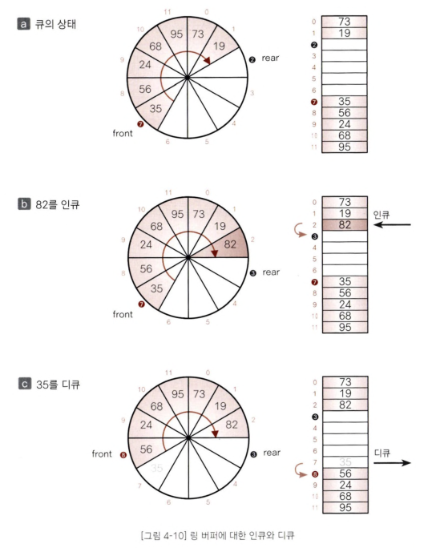

# 스택
데이터를 일시적으로 저장하기 위한 자료구조 
> 가장 나중에 넣은 데이터를 가장 먼저 꺼냅니다.
>- 후입선출(LIFO, Last In First Out)
- 데이터 넣는 작업: push
- 스택에서 데이터를 꺼내는 작업 : pop
- push하고 pop하는 위치를 곡대기(top)라 하고, 스택의 가장 아랫부분을 바닥(bottom)

# 큐(Queue)
- 데이터를 일시적으로 쌓아두기 위한 자료구조
> - 가장 먼저 넣은 데이터를 가장 먼저 꺼내는 `선입선출` 구조
> - ex) 은행창구에서 차례를 기다리는 대기열, 마트에서 계산을 기다리는 대기열 등

- `인큐`(enqueue): 데이터를 넣는 작업
- `디큐`(dequeue): 데이터를 꺼내는 작업

- `프런트`(front): 데이터를 꺼내는 쪽
- `리어`(rear): 데이터를 넣는 쪽

 

 
1. 24 인큐: 복잡도 O(1), 적은 비용으로 구현
2. 19 디큐: 복잡도 O(n), 데이터를 꺼낼 때마다 처리하면 효율이 떨어진다. 
- 19를 디큐하고 두번째 이후 요소들을 앞으로 옮기면 효율 떨어짐 

### 링 버퍼로 큐 만들기 - O(1)

- 배열의 처음이 끝과 연결되었다고 보는 자료구조
- 프런트: 맨 처음 요소의 인덱스
- 리어: 맨 끝 요소의 하나 뒤의 인덱스(다음 요소를 인큐할 위치를 미리 지정)
