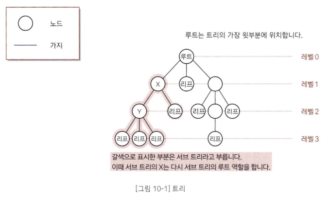
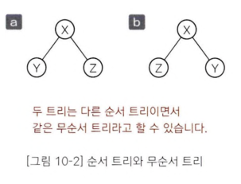

# 트리
- 데이터 사이의 계층 관계를 나타내는 자료구조

## 용어
- 노드(node)와 가지(edge)
1. 노드는 가지를 통해 다른 노드와 연결된다. ○는 노드, ―는 가지를 나타낸다.

2. 루트 : 트리의 가장 윗 부분에 위치하는 노드
3. 리프: 트리의 가장 아랫부분에 위치하는 노드를 리프(leaf)-> `더 이상 뻗어나갈 수 없는 마지막 노드`
  - 리프는 자식을 가질 수 없다!
4. 안쪽 노드: 루트를 포함한, 리프를 제외한 노드를 안쪽 노드
5. 자식: 가지로 연결된 아래쪽 노드를 자식(child)라고 한다. 노드는 자식을 여러 개 가질 수 있다.
6. 부모: 어떤 노드에서 가지로 연결된 위쪽 노드를 부모(parent), 노드는 1개의 부모를 갖는다.
7. 형제: 같은 부모를 가지는 노드
8. 조상: 어떤 노드에서 가지로 연결된 위쪽 노드 모두를 조상 
9. 자손: 어떤 노드에서 가지로 연결된 아래쪽 노드 모두 
10. 레벨: 루트로부터 얼마나 떨어져있는지에 대한 값을 레벨. 
  - 루트의 레벨: 0
  - 가지가 하나씩 뻗어갈 때마다 레벨이 1씩 늘어난다. 
11. 차수: 노드가 갖는 자식의 수를 차수(degree)
  - X의 차수: 2, Y의 차수는 3
  - 모든 노드의 차수가 n 이하인 트리를 n진트리 
12. 높이: 루트로부터 가장 멀리 떨어진 리프까지의 거리(리프 레벨의 최댓값)
13. 서브 트리: 트리 안에서 어떤 노드를 루트로 정하고, 그 자손으로 이루어진 트리를 서브트리
14. 널 트리: 가지가 없는 트리
15. 순서 트리와 무순서 트리
- `순서 트리(ordered tree)`: 형제 노드의 순서를 따짐
- `무순서 트리(unordered tree)`: 형제 노드의 순서를 따지지 않음
- 

## 순서 트리 탐색
### 너비 우선 탐색(breath-first Search)
-낮은 레벨에서 시작해 왼쪽에서 오른쪽 방향으로 검색, 한 레벨에서의 검색이 끝나면 다음 레벨로 내려감
- 

### 깊이 우선 탐색(depth-first Search)
- 리프까지 내려가면서 검색하는 것을 우선순위로 하는 탐색방법
- 