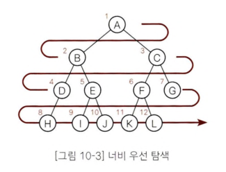
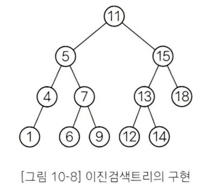

# 트리
- 데이터 사이의 계층 관계를 나타내는 자료구조

## 용어
- 노드(node)와 가지(edge)
1. 노드는 가지를 통해 다른 노드와 연결된다. ○는 노드, ―는 가지를 나타낸다.

2. 루트 : 트리의 가장 윗 부분에 위치하는 노드
3. 리프: 트리의 가장 아랫부분에 위치하는 노드를 리프(leaf)-> `더 이상 뻗어나갈 수 없는 마지막 노드`
  - 리프는 자식을 가질 수 없다!
4. 안쪽 노드: 루트를 포함한, 리프를 제외한 노드를 안쪽 노드
5. 자식: 가지로 연결된 아래쪽 노드를 자식(child)라고 한다. 노드는 자식을 여러 개 가질 수 있다.
6. 부모: 어떤 노드에서 가지로 연결된 위쪽 노드를 부모(parent), 노드는 1개의 부모를 갖는다.
7. 형제: 같은 부모를 가지는 노드
8. 조상: 어떤 노드에서 가지로 연결된 위쪽 노드 모두를 조상 
9. 자손: 어떤 노드에서 가지로 연결된 아래쪽 노드 모두 
10. 레벨: 루트로부터 얼마나 떨어져있는지에 대한 값을 레벨. 
  - 루트의 레벨: 0
  - 가지가 하나씩 뻗어갈 때마다 레벨이 1씩 늘어난다. 
11. 차수: 노드가 갖는 자식의 수를 차수(degree)
  - X의 차수: 2, Y의 차수는 3
  - 모든 노드의 차수가 n 이하인 트리를 n진트리 
12. 높이: 루트로부터 가장 멀리 떨어진 리프까지의 거리(리프 레벨의 최댓값)
13. 서브 트리: 트리 안에서 어떤 노드를 루트로 정하고, 그 자손으로 이루어진 트리를 서브트리
14. 널 트리: 가지가 없는 트리
15. 순서 트리와 무순서 트리
- `순서 트리(ordered tree)`: 형제 노드의 순서를 따짐
- `무순서 트리(unordered tree)`: 형제 노드의 순서를 따지지 않음
- 

## 순서 트리 탐색
## 너비 우선 탐색(breath-first Search)
-낮은 레벨에서 시작해 왼쪽에서 오른쪽 방향으로 검색, 한 레벨에서의 검색이 끝나면 다음 레벨로 내려감
- 

 

## 깊이 우선 탐색(depth-first Search)

- 리프까지 내려가면서 검색하는 것을 우선순위로 하는 탐색방법
- 노드를 지나가는 최대 횟수: 3

### 전위순회(Preorder)
- 노드 방문-> 왼쪽 자식 -> 오른쪽 자식
- A - B- D - H - E - I - J - C - F - K - L - G

### 중위 순회(Inorder)
- 왼쪽 자식 -> 노드 방문 -> 오른쪽 자식
- H - D - B - I - E - J - A - K - F - L - C - G

### 후위 순회(PostOrder)
- 왼쪽 자식 -> 오른쪽 자식 -> (돌아와) 노드 방문
- H - D - I - J - E - B - K - L - F - G - C - A

---

## 이진트리(binary tree)

왼쪽 자식과 오른쪽 자식을 갖는 트리를 이진트리
- 각 노드의 자식은 2명 이하만 유지해야 한다. 
- 왼쪽 자식과 오른쪽 자식을 구분한다는 점
- 왼쪽 자식을 다시 루트로 하는 서브트리를 왼쪽 서브트리,(갈색)
- 오른쪽 자식을 다시 루트로 하는 서브트리를 오른쪽 서브트리(회색)

## 완전이진트리(complete binary tree)
- 루트로부터 노드가 채워져 있으면서 같은 레벨에서는 왼쪽에서 오른쪽으로 노드가 채워져 있는 이진트리

> 1. 마지막 레벨을 제외한 레벨은 노드를 가득 채운다.
> 2. 마지막 레벨은 왼쪽부터 오른쪽 방향으로 노드를 채우되 반드시 끝까지 채울 필요는 없다.

높이가 k인 완전이진트리가 가질 수 있는 노드의 최댓값은 `2^k+1 -1개`이다.

n개의 노드를 저장할 수 있는 완전이진트리의 높이는 `log n`입니다.

---
## 이진검색트리(binary search tree)
1. 어떤 노드 N을 기준으로 왼쪽 서브 트리 노드의 모든 키 값은 노드 N의 키 값보다 작아야 한다. 
2. 오른쪽 서브트리 노드의 키 값은 노드 N의 키 값보다 커야 한다. 
3. 같은 키 값을 갖는 노드는 없다. 

> 중위 순회: 1 - 4 - 5 - 6 - 7 - 9 - 11 - 12 - 13 - 14 - 15 - 18
- 노드 5의 왼쪽 서브트리 노드 (4, 1)는 모두 5보다 작다. 
- 오른쪽 서브트리 노드(7, 6, 9)는 모두 5보다 크다.
- 중위순회를 하면 키 값의 오름차순으로 노드를 얻을 수 있다는 점, 구조가 단순하다는 점, 
- 이진검색과 비슷한 방식으로 검색이 가능하다는 점, 노드의 삽입이 쉽다는 점 등 특징

## 이진검색트리 만들기
노드 클래스 Node<K,V>

- 1개의 생성자와 3개의 메서드가 있다.
- 생성자, getKey메서드, getValue 메서드, print 데이터 출력메서드